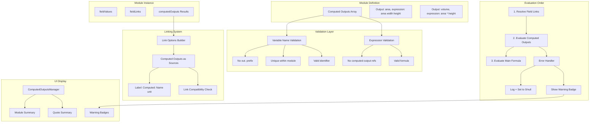

# Computed Outputs Implementation Plan (Refined)

## Overview

Add a `computedOutputs` feature to modules that allows declaring named computed values (backed by existing functions/formulas). These outputs are evaluated before the main formula, stored in a reserved namespace (`out.variableName`), and exposed as linkable sources for other modules.

**Key Safety Features**:
- Reserved `out.` namespace with validation guardrails
- Separate UI manager for computed outputs
- Auto-generated variable names with uniqueness enforcement
- Graceful error handling with UI warnings
- Clear linking labels with units
- Proper formula tokenization

## Architecture Overview



## Data Model Changes

### 1. Extend CalculationModule Interface

**File**: `lib/types.ts`

```typescript
// Add new interface for computed outputs
export interface ComputedOutput {
  id: string;
  label: string; // Display name (e.g., "Paint Area")
  variableName: string; // Variable name WITHOUT out. prefix (e.g., "paint_area_m2")
  expression: string; // Formula expression (e.g., "area(width, height)" or "width * height")
  unitSymbol?: string; // Optional unit symbol (e.g., "m2")
  unitCategory?: UnitCategory; // Optional unit category
  description?: string; // Optional help text
}

// Extend CalculationModule interface
export interface CalculationModule {
  id: string;
  name: string;
  description?: string;
  category?: string;
  fields: Field[];
  formula: string;
  computedOutputs?: ComputedOutput[]; // NEW: Array of computed outputs
  createdAt: string;
  updatedAt: string;
}
```

### 2. Runtime Storage

**Storage Format**: Computed outputs are stored in `fieldValues` under the `out.` namespace:

```typescript
fieldValues: {
  width: 10,
  height: 5,
  'out.area': 50,        // Computed output (with prefix in storage)
  'out.volume': 250,     // Computed output (with prefix in storage)
  // ... other fields
}
```

**Reserved Namespace**: The `out.` prefix is reserved. User fields cannot start with `out.` to avoid collisions.

**UI Display**: Variable names are displayed WITHOUT the `out.` prefix in the UI (only added during storage/evaluation).

## Implementation Phases

### Phase 1: Data Model & Validation Helpers

**Files**: `lib/types.ts`, `lib/utils/computed-outputs.ts` (new)

**Changes**:
1. Add `ComputedOutput` interface
2. Extend `CalculationModule` with `computedOutputs?: ComputedOutput[]`
3. Create validation helpers:
   - `validateComputedOutputVariableName(name: string, existingOutputs: ComputedOutput[], existingFields: Field[]): { valid: boolean; error?: string }`
     - Check: doesn't start with `out.`
     - Check: valid identifier pattern `/^[a-zA-Z_][a-zA-Z0-9_]*$/`
     - Check: unique within module (not in existing outputs or fields)
   - `generateComputedOutputVariableName(label: string, existingOutputs: ComputedOutput[], existingFields: Field[]): string`
     - Use `labelToVariableName` as base
     - Ensure uniqueness by appending number if needed
     - Validate against `out.` prefix
   - `validateComputedOutputExpression(expression: string, fields: Field[], computedOutputs: ComputedOutput[], functions: SharedFunction[]): { valid: boolean; error?: string; warnings?: string[] }`
     - Use existing `validateFormula`
     - **CRITICAL**: Check that expression does NOT reference other computed outputs (only fields, functions, materials)
     - Return clear error if computed output reference detected

**Legacy Module Loading**:
- Create helper: `sanitizeLegacyModule(module: CalculationModule): CalculationModule`
  - Check all fields for `variableName` starting with `out.`
  - If found: warn and auto-rename (e.g., `out.area` → `_out_area`)
  - Return sanitized module

**Validation**:
- TypeScript compiles without errors
- Backward compatibility (existing modules without `computedOutputs` work)
- Legacy modules with `out.` fields are handled gracefully

---

### Phase 2: Module Editor UI - ComputedOutputsManager Component

**Files**: `components/module-editor/ComputedOutputsManager.tsx` (new)

**Changes**:
1. Create new separate component (not mixed with FieldsManager)
2. Features:
   - "Computed Outputs" section header
   - "Add Computed Output" button
   - List of computed outputs (chips or cards)
   - For each computed output:
     - Label input (auto-generates variableName)
     - Variable name input (editable, but validated)
     - Expression input (use FormulaBuilder component)
     - Unit selector (optional)
     - Description input (optional)
     - Delete button
   - Real-time validation feedback
   - Block edits when invalid

**UI Layout**:
```
┌─────────────────────────────────┐
│ Computed Outputs                │
│ [+ Add Computed Output]        │
│                                 │
│ ┌─────────────────────────────┐ │
│ │ Paint Area                  │ │
│ │ Variable: paint_area_m2     │ │
│ │ Expression: area(width, height) │
│ │ Unit: m²                    │ │
│ │ [Delete]                    │ │
│ └─────────────────────────────┘ │
└─────────────────────────────────┘
```

**Key Behaviors**:
- Label changes → auto-generate variableName (using `generateComputedOutputVariableName`)
- Variable name edits → validate in real-time
- Expression changes → validate (check for computed output references)
- Show validation errors inline
- Disable save if any computed output is invalid

**Integration**:
- Add `ComputedOutputsManager` to module editor page
- Position after FieldsManager or in separate tab/section

---

### Phase 3: Evaluation Logic - Compute Outputs Before Formula

**Files**: 
- `lib/utils/evaluate-computed-outputs.ts` (new)
- `lib/stores/quotes-store.ts`
- `hooks/use-template-editor.ts`

**Changes**:
1. Create `evaluateComputedOutputs` function:
   ```typescript
   function evaluateComputedOutputs(
     moduleDef: CalculationModule,
     resolvedFieldValues: Record<string, string | number | boolean>,
     materials: Material[],
     functions: SharedFunction[]
   ): {
     computedValues: Record<string, number>;
     errors: Array<{ outputId: string; outputLabel: string; error: string }>;
   }
   ```
   - For each computed output:
     - Evaluate expression using `evaluateFormula`
     - On success: store in `computedValues['out.${output.variableName}']`
     - On failure: log error, add to errors array, set value to `null` or `0`
   - Return both computed values and errors

2. Update evaluation order in `recalculateWorkspaceModules`:
   ```
   1. Resolve field links → resolvedValues
   2. Evaluate computed outputs → { computedValues, errors }
   3. Merge computedValues into resolvedValues
   4. Evaluate main formula (can reference out.*)
   5. Store errors for UI display
   ```

3. Update `recalculateModules` in template editor similarly

**Error Handling**:
- Catch evaluation errors gracefully
- Log to console with context
- Set failed outputs to `null` or `0` (decide: `null` for "not computed", `0` for "failed")
- Return errors array for UI display
- **Don't block** main formula evaluation if computed outputs fail

**Evaluation Context**:
```typescript
const context: EvaluationContext = {
  fieldValues: resolvedValues, // Includes regular fields + linked values
  materials,
  functions,
  fields: moduleDef.fields,
  // Note: computed outputs NOT in context (they can't reference each other)
};
```

---

### Phase 4: Formula Access - Support `out.variableName` References

**Files**: `lib/formula-evaluator.ts`

**Changes**:
1. **Tokenization**: Ensure `out.area` is parsed as a SINGLE variable token, not property access
   - Update variable regex to recognize `out\.[a-zA-Z_][a-zA-Z0-9_]*` pattern
   - Or handle in variable resolution step (check for `out.` prefix)

2. **Variable Resolution**: Update resolution order:
   ```
   1. Regular field: fieldValues[varName]
   2. Computed output: fieldValues['out.${varName}'] (if varName starts with 'out.')
   3. Material property: material.property
   4. Field property: fieldVar.property
   ```

3. **Validation**: Update `validateFormula` and `analyzeFormulaVariables`:
   - Recognize `out.variableName` as valid variable
   - Check that referenced computed outputs exist
   - Show clear error if computed output not found: `"Computed output 'area' not found"`

**Formula Examples**:
- Main formula: `out.area * paint` - Uses computed output
- Computed output expression: `area(width, height)` - Uses function (NOT `out.area`)
- Invalid: `out.area * out.volume` in computed output expression (would fail validation)

**Variable Parsing Strategy**:
- Option A: Parse `out.area` as single token in regex
- Option B: Parse `out` and `area` separately, then combine in resolution
- **Recommendation**: Option A (single token) for cleaner parsing

---

### Phase 5: Linking System - Expose Computed Outputs as Link Sources

**Files**: 
- `hooks/use-quote-field-linking.ts`
- `lib/utils/field-linking.ts`

**Changes**:
1. Update `buildLinkOptions` to scan all module instances for computed outputs
2. For each computed output, add to link options:
   - Value: `instanceId.out.variableName` (with `out.` prefix for storage)
   - Label: `"Computed: Label (unit)"` (e.g., `"Computed: Paint Area (m²)"`)
   - Show unit in label if available
3. Update `getLinkDisplayName` to handle computed output links:
   - Format: `"Module Name — Computed: Label (unit)"`
4. Update `getResolvedValue` to resolve computed output values:
   - Check `fieldValues['out.${varName}']` on source instance
5. Update type/unit compatibility checking for computed outputs

**Link Option Format**:
```typescript
{
  value: 'area-instance-id.out.area',
  label: 'Area Module — Computed: Paint Area (m²)'
}
```

**Link Storage**:
- Stored normally in `fieldLinks` as:
  ```typescript
  {
    moduleInstanceId: 'area-instance-id',
    fieldVariableName: 'out.area' // WITH out. prefix
  }
  ```
- Resolution checks `fieldValues['out.area']` on source instance

**UI Display**:
- Link options dropdown shows: `"Computed: Paint Area (m²)"`
- Link status shows: `"Linked to: Area Module — Computed: Paint Area (m²)"`

---

### Phase 6: UI Display - Show Computed Outputs & Warnings

**Files**: 
- `components/SortableModuleCard.tsx`
- `components/quotes/QuoteSummaryCard.tsx` (optional)

**Changes**:
1. **Module Card Display**:
   - Show computed outputs in module header/summary
   - Format: `"Label: value unit"` (e.g., `"Paint Area: 125 m²"`)
   - Show as chips or badges
   - **Show warning badge** if evaluation failed (red/yellow indicator)

2. **Module Detail View**:
   - Show computed outputs section:
     - Read-only display
     - Show expression used
     - Show computed value (or error message)
     - Warning badge if failed

3. **Error Display**:
   - Create `ComputedOutputWarning` component:
     - Small badge/icon next to failed outputs
     - Tooltip shows error message
     - Color: yellow (warning) or red (error)

**Display Format**:
```
┌─────────────────────────────────┐
│ Area Module                     │
│                                 │
│ Computed Outputs:               │
│   Paint Area: 125 m²            │
│   Volume: [⚠️] Failed            │
│                                 │
│ Cost: $1,250.00                 │
└─────────────────────────────────┘
```

---

### Phase 7: Legacy Module Migration & Regeneration Safety

**Files**: 
- `lib/utils/computed-outputs.ts`
- `lib/stores/modules-store.ts` (on load)

**Changes**:
1. **Legacy Module Sanitization**:
   - On module load, check for fields with `variableName` starting with `out.`
   - Auto-rename: `out.area` → `_out_area` (or similar)
   - Log warning: `"Module 'X' has field 'out.area' - renamed to '_out_area'"`
   - Save sanitized module back to store

2. **Regeneration Helper**:
   - Create `regenerateComputedOutputVariableNames(module: CalculationModule): CalculationModule`
   - For each computed output:
     - Regenerate variable name from label
     - Ensure uniqueness
     - Validate against `out.` prefix
   - Use when loading modules or when computed output library is updated

3. **Validation on Load**:
   - Validate all computed outputs when module is loaded
   - Fix invalid variable names automatically
   - Log warnings for invalid expressions

**Migration Strategy**:
- Run sanitization on module load (one-time)
- Store sanitized version back
- No breaking changes for users

---

### Phase 8: Formula Tokenization & Analysis Updates

**Files**: `lib/formula-evaluator.ts`

**Changes**:
1. **Token Parsing**:
   - Update variable regex to include `out\.[a-zA-Z_][a-zA-Z0-9_]*` pattern
   - Ensure `out.area` is parsed as single token (not `out` + `.` + `area`)

2. **Variable Analysis**:
   - Update `analyzeFormulaVariables` to:
     - Recognize `out.variableName` tokens
     - Categorize as "Computed Outputs" in debug panel
     - Show which computed outputs are referenced
     - Show missing computed outputs as errors

3. **Validation Messages**:
   - Clear error messages: `"Computed output 'area' not found in module"`
   - Suggest available computed outputs if typo detected

**Debug Panel Updates**:
```
Formula debug (detected variables)
Standalone Variables (2)
  width, height
Computed Outputs (1)
  out.area
Unknown Variables (0)
  None
```

---

### Phase 9: Quote Summary Integration

**Files**: 
- `lib/stores/quotes-store.ts`
- `components/quotes/QuoteSummaryCard.tsx` (optional enhancement)

**Changes**:
1. **Update `addLineItem` to include computed outputs in `fieldSummary`**:
   - Evaluate computed outputs before generating summary
   - Prioritize computed outputs in summary (they're often key metrics)
   - Include computed outputs with units: `"Paint Area: 50 m²"`
   - Store computed outputs in `fieldValues` snapshot (with `out.` prefix)

2. **Summary Generation Logic**:
   ```typescript
   // 1. Evaluate computed outputs first
   const computedValues = evaluateComputedOutputs(
     moduleDef,
     resolved,
     materials,
     functions
   );
   
   // 2. Generate summary prioritizing computed outputs
   const summaryParts: string[] = [];
   
   // Add computed outputs first (they're often the most important)
   if (moduleDef.computedOutputs) {
     moduleDef.computedOutputs.forEach((output) => {
       const value = computedValues.computedValues[`out.${output.variableName}`];
       if (value !== null && value !== undefined) {
         const unitStr = output.unitSymbol ? ` ${output.unitSymbol}` : '';
         summaryParts.push(`${output.label}: ${value}${unitStr}`);
       }
     });
   }
   
   // Add regular fields (limit total to 3-4 items)
   const remainingSlots = Math.max(0, 4 - summaryParts.length);
   if (remainingSlots > 0) {
     moduleDef.fields
       .slice(0, remainingSlots)
       .forEach((field) => {
         const value = resolved[field.variableName];
         if (value !== null && value !== undefined) {
           summaryParts.push(`${field.label}: ${value}`);
         }
       });
   }
   
   const fieldSummary = summaryParts.join(', ') || 'No details';
   ```

3. **Store computed outputs in line item snapshot**:
   - Merge computed output values into `fieldValues` snapshot
   - Use `out.` prefix: `fieldValues['out.area'] = 50`
   - This ensures computed outputs are preserved in the line item snapshot

4. **Optional: Enhanced Quote Summary Display**:
   - Update `QuoteSummaryCard` to optionally show computed outputs separately
   - Could display as additional metadata below field summary
   - Format: `"Computed: Paint Area: 50 m², Volume: 250 m³"`

**Display Examples**:

**Before** (only regular fields):
```
Paint Job: Width: 10, Height: 5, Paint: 2 L/m²
```

**After** (with computed outputs prioritized):
```
Paint Job: Paint Area: 50 m², Coverage: 100 m²
```

Or if both computed outputs and fields:
```
Paint Job: Paint Area: 50 m², Coverage: 100 m², Width: 10
```

**Integration Points**:
- Depends on Phase 3 (evaluation logic) - `evaluateComputedOutputs` must be available
- Works with Phase 6 (UI display) - computed outputs already evaluated
- Enhances quote summary card display (Phase 6)

**Storage Format**:
```typescript
// Line item fieldValues snapshot includes computed outputs
fieldValues: {
  width: 10,
  height: 5,
  'out.area': 50,        // Computed output snapshot
  'out.volume': 250,     // Computed output snapshot
}
```

**Testing**:
- [ ] Computed outputs appear in `fieldSummary` when adding line items
- [ ] Computed outputs are prioritized over regular fields
- [ ] Units are displayed correctly in summary
- [ ] Computed outputs are stored in line item `fieldValues` snapshot
- [ ] Summary displays correctly in quote summary card
- [ ] Summary displays correctly in PDF export

---

## Data Flow Example

**Scenario**: Area module with computed output, Painting module uses area output

1. **Module Definition**:
   - Area Module:
     - Fields: `width` (number, m), `height` (number, m)
     - Computed Outputs:
       - `area`: label "Paint Area", variableName "area", expression `area(width, height)`, unit `m²`
     - Formula: `out.area * 10` (example)
   - Painting Module:
     - Fields: `area` (number, m²) - will link to computed output
     - Fields: `paint` (number, L/m²)
     - Formula: `area * paint`

2. **Quote Instance**:
   - Area Module Instance:
     - `fieldValues: { width: 10, height: 5 }`
     - Evaluation:
       1. Resolve links: `{ width: 10, height: 5 }`
       2. Evaluate computed outputs: `out.area = area(10, 5) = 50`
       3. Update fieldValues: `{ width: 10, height: 5, 'out.area': 50 }`
       4. Evaluate formula: `out.area * 10 = 50 * 10 = 500`
   - Painting Module Instance:
     - `fieldLinks: { area: { moduleInstanceId: 'area-instance', fieldVariableName: 'out.area' } }`
     - Resolved: `area = 50` (from linked computed output)
     - Formula: `50 * paint`

## Testing Checklist

### Phase 1-2: Types & UI
- [ ] ComputedOutput type defined
- [ ] Variable name validation prevents `out.` prefix
- [ ] Variable name validation ensures uniqueness
- [ ] Expression validation prevents computed output references
- [ ] Module editor shows ComputedOutputsManager
- [ ] Can add/edit/delete computed outputs
- [ ] Auto-generation of variable names works
- [ ] Legacy modules with `out.` fields are sanitized

### Phase 3-4: Evaluation & Formula Access
- [ ] Computed outputs evaluate before main formula
- [ ] Results stored in `fieldValues['out.variableName']`
- [ ] Formulas can reference `out.variableName`
- [ ] `out.area` parsed as single token
- [ ] Error handling sets failed outputs to null/0
- [ ] Errors logged and returned for UI

### Phase 5-6: Linking & Display
- [ ] Computed outputs appear in link options with "Computed:" prefix
- [ ] Units shown in link labels
- [ ] Can link to computed outputs
- [ ] Computed outputs display in module cards
- [ ] Warning badges show for failed outputs
- [ ] Link resolution works correctly

### Phase 7-8: Migration & Analysis
- [ ] Legacy modules sanitized on load
- [ ] Variable name regeneration works
- [ ] Formula analysis shows computed outputs
- [ ] Clear error messages for missing outputs
- [ ] Debug panel categorizes computed outputs correctly

### Phase 9: Quote Summary Integration
- [ ] Computed outputs appear in `fieldSummary` when adding line items
- [ ] Computed outputs are prioritized over regular fields
- [ ] Units are displayed correctly in summary
- [ ] Computed outputs are stored in line item `fieldValues` snapshot
- [ ] Summary displays correctly in quote summary card
- [ ] Summary displays correctly in PDF export

## Migration Notes

- **Backward Compatibility**: Existing modules without `computedOutputs` continue to work
- **No Breaking Changes**: All changes are additive
- **Reserved Namespace**: User fields cannot start with `out.` (validation prevents this)
- **Legacy Handling**: Modules with `out.` fields are auto-sanitized on load
- **Runtime Only**: Computed output values are computed at runtime, not persisted

## Files to Modify

1. `lib/types.ts` - Add `ComputedOutput` interface, extend `CalculationModule`
2. `lib/utils/computed-outputs.ts` (new) - Validation, generation, sanitization helpers
3. `components/module-editor/ComputedOutputsManager.tsx` (new) - UI for managing computed outputs
4. `lib/utils/evaluate-computed-outputs.ts` (new) - Evaluation logic with error handling
5. `lib/stores/quotes-store.ts` - Update evaluation order, add computed outputs to `fieldSummary` in `addLineItem`
6. `hooks/use-template-editor.ts` - Update evaluation order
7. `lib/formula-evaluator.ts` - Support `out.variableName` references, tokenization
8. `hooks/use-quote-field-linking.ts` - Include computed outputs in link options
9. `components/SortableModuleCard.tsx` - Display computed outputs with warnings
10. `lib/stores/modules-store.ts` - Legacy module sanitization on load
11. `components/shared/ComputedOutputWarning.tsx` (new) - Warning badge component
12. `components/quotes/QuoteSummaryCard.tsx` - Optional enhancement for computed output display

## Estimated Complexity

- **Phase 1**: Medium (validation helpers, legacy handling)
- **Phase 2**: Medium (separate manager component)
- **Phase 3**: Medium (evaluation with error handling)
- **Phase 4**: Medium (tokenization, variable resolution)
- **Phase 5**: Medium (linking system updates)
- **Phase 6**: Low (display components)
- **Phase 7**: Low (migration helpers)
- **Phase 8**: Low (analysis updates)
- **Phase 9**: Low (quote summary integration)

**Total**: Medium-High complexity, but incremental and testable at each phase.

## Key Safety Features

1. **Namespace Guardrails**: 
   - Validation prevents `out.` prefix in user fields
   - Legacy modules auto-sanitized
   - UI displays without prefix

2. **Regeneration Safety**: 
   - Helper to regenerate/validate variable names
   - Ensures uniqueness and validity

3. **Evaluation Safety**: 
   - No computed output cross-references (validated)
   - Graceful error handling
   - UI warnings for failures

4. **Formula Safety**: 
   - Proper tokenization (`out.area` as single token)
   - Clear error messages
   - Debug panel support

5. **Linking Safety**: 
   - Clear labels with "Computed:" prefix
   - Unit information in labels
   - Proper storage format

6. **UI Safety**: 
   - Separate manager component
   - Auto-generation with validation
   - Real-time feedback
   - Warning badges for errors

